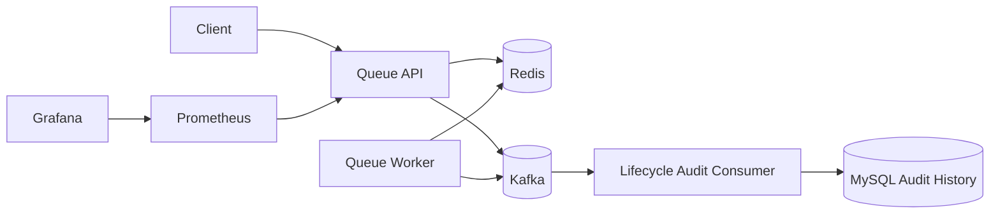

# Queue Service

Redis와 Kafka를 기반으로 한 대기열 서비스이다.

짧은 시간에 트래픽이 집중되는 상황에서 사용자 요청을 대기열로 흡수하고, 공정한 순번과 제한된 입장 수를 기준으로 다운스트림 시스템의 부하를 제어하는 것을 목표로 한다.

## 주요 기능

- 대기열 진입
- 사용자별 중복 진입 방지
- 순번 기반 waiting queue 관리
- active 사용자 수 제한
- active 사용자 만료 처리
- Kafka lifecycle 이벤트 발행
- Audit Consumer 기반 이벤트 이력 저장
- Prometheus / Grafana 기반 모니터링
- k6 기반 부하 테스트

## Architecture



## Tech Stack

- Java 17
- Spring Boot 3.3
- Gradle
- Redis
- Kafka
- MySQL
- Prometheus
- Grafana
- k6
- Docker Compose

## API

### 대기열 진입

```http
POST /api/v1/queues/enter
```

Request:

```json
{
  "queueId": "product:100",
  "userId": 100000
}
```

Response:

```json
{
  "token": "...",
  "queueId": "product:100",
  "userId": 100000,
  "status": "WAITING",
  "position": 1,
  "enteredAt": "...",
  "expiresAt": null
}
```

### 대기열 상태 조회

```http
GET /api/v1/queues/{queueName}/entries/{queueToken}
```

## Queue Status

현재 구현 기준 상태값은 다음과 같다.

- `WAITING`
- `ACTIVE`
- `EXPIRED`
- `CANCELLED`

`ADMITTED`는 상태값이 아니라 Kafka lifecycle 이벤트 타입으로 사용한다.

## Redis Key

```text
queue:sequence:{queueId}
queue:waiting:{queueId}
queue:active:{queueId}
queue:active-expiry:{queueId}
queue:entry:{token}
queue:user-index:{queueId}:{userId}
```

## Kafka

Topic:

```text
queue.lifecycle.v1
```

Event Types:

```text
ENTERED
ADMITTED
EXPIRED
```

## Local Run

### 1. 인프라 실행

```powershell
docker compose up -d
```

실행되는 인프라:

- MySQL: `localhost:3307`
- Redis: `localhost:6379`
- Kafka: `localhost:9094`
- Prometheus: `localhost:9090`
- Grafana: `localhost:3000`

### 2. API 실행

```powershell
.\gradlew.bat :queue-api:bootRun
```

API 기본 주소:

```text
http://localhost:8081
```

Health Check:

```powershell
Invoke-RestMethod http://localhost:8081/actuator/health
```

## Load Test

k6를 사용해 대기열 진입 API를 테스트한다.

```powershell
.\monitoring\k6\run-k6.ps1 -Scenario smoke
.\monitoring\k6\run-k6.ps1 -Scenario load
.\monitoring\k6\run-k6.ps1 -Scenario stress
.\monitoring\k6\run-k6.ps1 -Scenario spike
```

PowerShell 실행 정책으로 막힐 경우:

```powershell
powershell -ExecutionPolicy Bypass -File .\monitoring\k6\run-k6.ps1 -Scenario smoke
```

## Monitoring

- Prometheus: `http://localhost:9090`
- Grafana: `http://localhost:3000`
- Grafana Login: `admin / admin`

## Documentation

상세 설계, 모니터링 구성, 부하 테스트 결과는 Notion 문서에 정리

- [대기열 시스템 상세 문서](https://www.notion.so/336d2aef6d31809097ced11a680d9b9e)
- [Prometheus + Grafana 기반 모니터링 문서](https://www.notion.so/Prometheus-Grafana-354d2aef6d3180d6891bf678be1eb58c)
