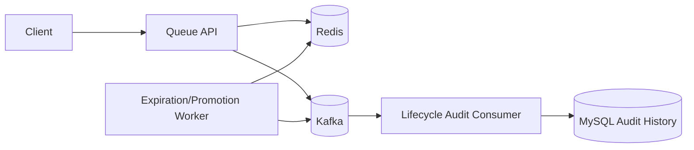
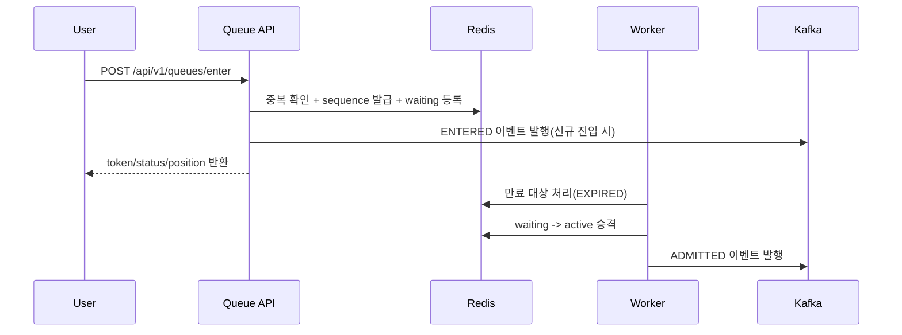

# Queue Service

짧은 시간에 트래픽이 집중되는 상황(이벤트 오픈, 한정 수량 판매, 선착순 참여)에서,
요청을 즉시 다운스트림으로 보내지 않고 대기열로 흡수해 **공정한 순서**와 **시스템 안정성**을 확보하는 서비스입니다.

## 1. 핵심 목표

- 대량 동시 요청을 대기열에서 완충
- 순번 기반 공정 진입 보장
- 동시 활성 사용자 수 제한으로 다운스트림 보호
- 중복 요청/재시도 상황에서도 멱등성 유지

## 2. 아키텍처



### 다이어그램 포함 판단

README에는 **다이어그램을 넣는 것이 좋습니다**.
다만 요약 문서인 만큼 `아키텍처 1개 + 핵심 흐름 1개` 수준으로 제한하는 것이 가장 읽기 좋습니다.

## 3. 핵심 처리 흐름



## 4. 현재 구현 기준 상태 모델

- `WAITING`
- `ACTIVE`
- `EXPIRED`
- `CANCELLED`

> 참고: Notion의 `ADMITTED`는 현재 코드에서는 이벤트 타입명(`ADMITTED`)으로 사용되고,
> 엔트리 상태값은 `ACTIVE`로 관리합니다.

## 5. API

- `POST /api/v1/queues/enter`
  - 요청: `queueId`, `userId`
  - 응답: `token`, `status`, `position`, `enteredAt`, `expiresAt`
- `GET /api/v1/queues/{queueName}/entries/{queueToken}`
  - 현재 상태/대기 순번 조회 (`WAITING` 또는 `ACTIVE`)

## 6. Redis 설계 (현재 코드 기준)

- `queue:sequence:{queueId}`: 순번 발급
- `queue:waiting:{queueId}`: 대기열 ZSET
- `queue:active:{queueId}`: 활성 사용자 ZSET
- `queue:active-expiry:{queueId}`: 만료 시각 관리 ZSET
- `queue:entry:{token}`: 사용자 엔트리 HASH
- `queue:user-index:{queueId}:{userId}`: 사용자 중복 진입 방지 인덱스

핵심 로직은 Lua 스크립트(`enqueue-or-get-existing`, `promote-waiting-entries`, `expire_active_entries`)로 원자 처리합니다.

## 7. Kafka 설계

- Topic: `queue.lifecycle.v1` (기본값)
- 발행 이벤트 타입: `ENTERED`, `ADMITTED` (현재 구현 기준)
- DLT: `queue.lifecycle.v1.dlt` (기본 규칙)

> `EXPIRED` 이벤트 타입은 도메인에 정의되어 있으나, 현재 배치 경로에서의 발행은 아직 연결되지 않았습니다.

## 8. 정합성 / 멱등성

- 진입 멱등성: `queue:user-index:{queueId}:{userId}`로 중복 진입 차단
- Redis 원자성: Lua 스크립트로 중복 등록/순번 꼬임 방지
- 소비자 멱등성: MySQL `event_id` 유니크 키 기반 `insert-if-absent`

## 9. 모니터링 / 성능 측정 요약

Prometheus + k6 기반으로 `POST /api/v1/queues/enter`를 검증했습니다.

- `up{job="queue-api"}` = `1`
- HTTP 요청 수: `6 -> 1967` (`+1961`)
- 처리율: 부하 구간 최대 약 `93 req/s`
- JVM Heap 사용량: 약 `79.18 MB`
- p95 응답 시간: 약 `6.7ms`

상세 절차/쿼리/스크린샷은 Notion 문서 참고:
- [Prometheus 기반 모니터링 및 성능 측정](https://www.notion.so/Prometheus-34fd2aef6d318039bfc7c776d2ab9e8c?pvs=21)

## 10. 로컬 실행

사전 조건
- Docker Desktop
- Docker Compose v2

```powershell
docker compose down -v
docker compose up -d --build
```

접속 정보
- API: `http://localhost:8081`
- Prometheus: `http://localhost:9090`
- Grafana: `http://localhost:3000` (`admin/admin`)
- MySQL: `localhost:3307`
- Redis: `localhost:6379`
- Kafka (host): `localhost:9094`
