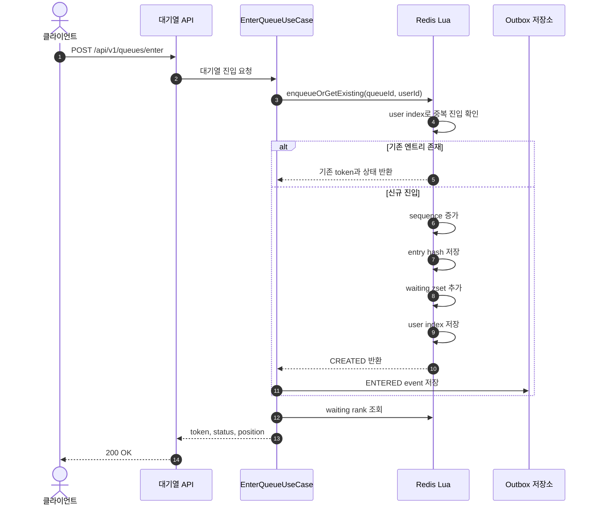
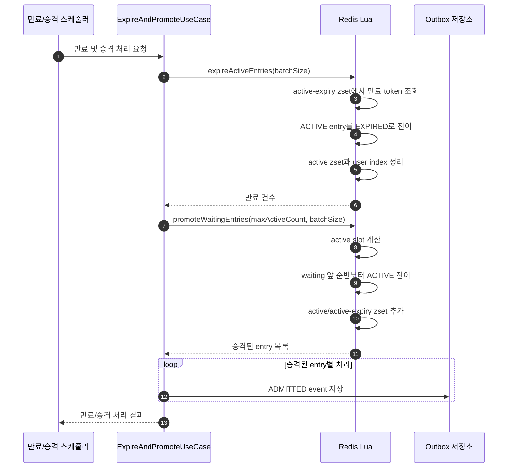
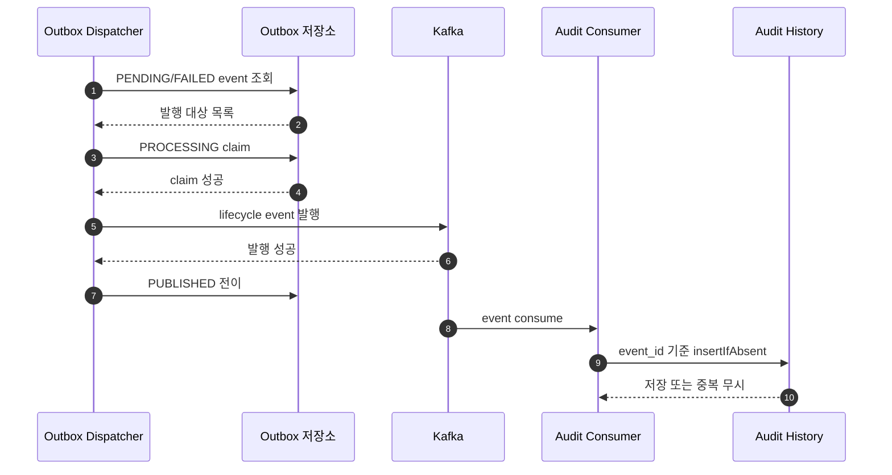
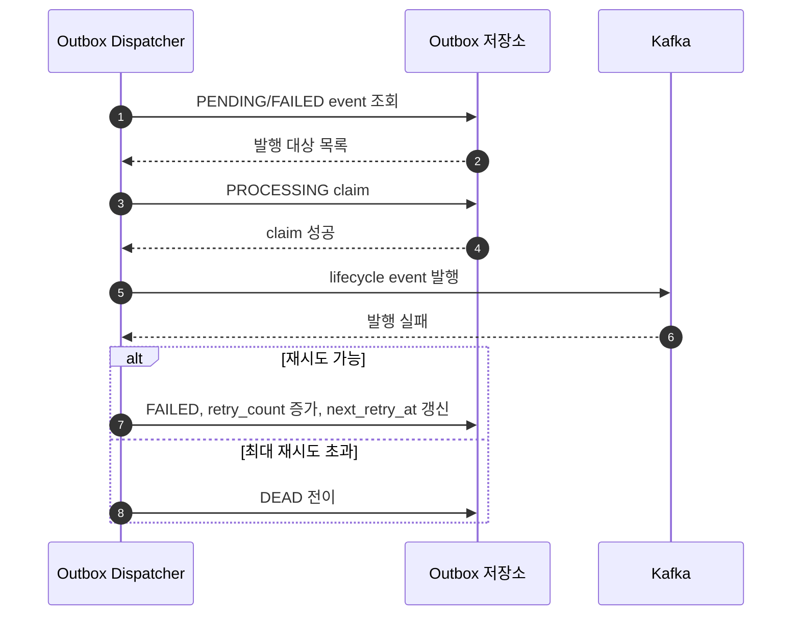
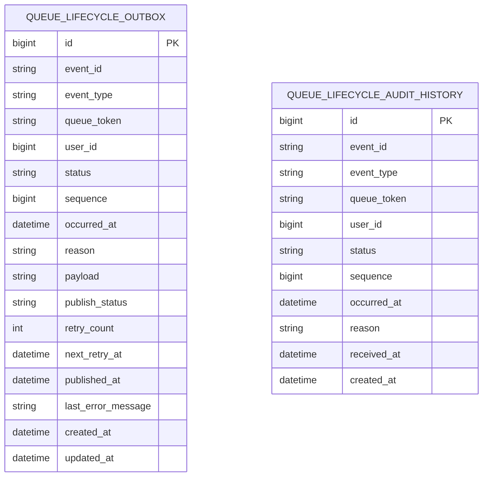
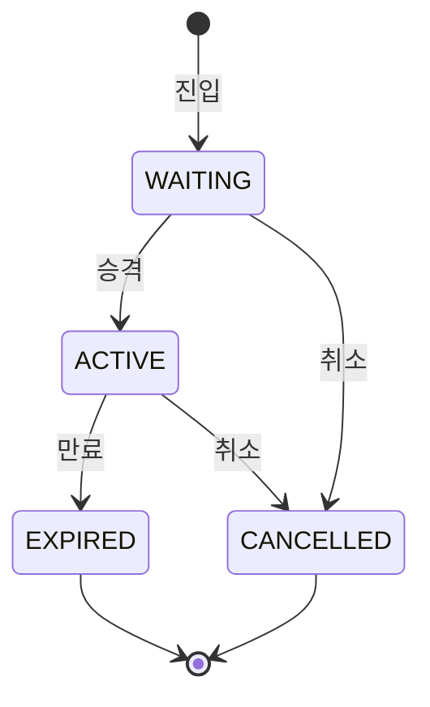
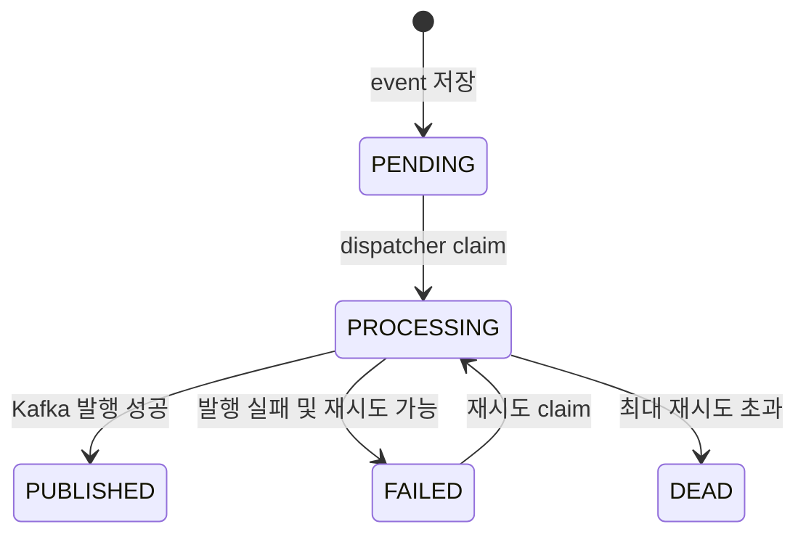

# 아키텍처 다이어그램

이 문서는 현재 구현 기준으로 운영 관점에서 필요한 흐름을 정리한다. 핵심은 Redis 원자 처리, 상태 전이, Outbox 기반 비동기 복구 흐름이다.

## 대기열 진입

## 대기열 승격과 만료

## Outbox 발행 성공

## Outbox 발행 실패

## ERD

Redis entry와 queue 자료구조는 Redis key-value 구조이므로 ERD에는 포함하지 않는다. 관련 key 설계는 [Redis 자료구조와 Lua 원자 처리](redis-queue-design.md)를 참고한다.

## 상태 다이어그램

### 대기열 엔트리

### Outbox 이벤트

