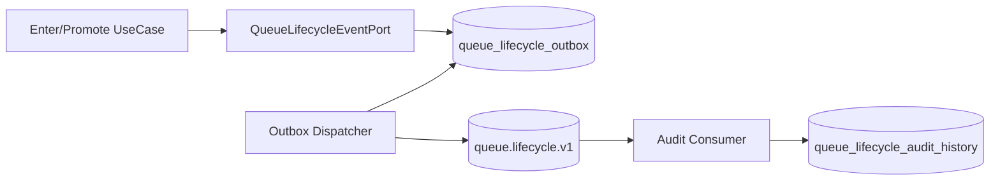

# 라이프사이클 Outbox와 Kafka 감사

## 목적

대기열 상태 변경 후 Kafka 직접 발행에 실패하면 lifecycle event가 유실될 수 있다. 이를 줄이기 위해 application service는 Kafka에 직접 publish하지 않고 `QueueLifecycleEventPort`를 통해 MySQL outbox에 event를 먼저 저장한다.

## 저장 흐름

## Outbox 상태

| 상태 | 의미 |
| --- | --- |
| `PENDING` | 저장됐고 아직 발행되지 않음 |
| `PROCESSING` | dispatcher가 claim 후 처리 중 |
| `PUBLISHED` | Kafka 발행 성공 |
| `FAILED` | 발행 실패, `next_retry_at` 이후 재시도 |
| `DEAD` | 최대 재시도 초과 |

## Dispatcher 정책

- `PENDING`, `FAILED` 중 `next_retry_at <= now`인 row를 batch 조회한다.
- row별로 `PROCESSING` 상태 claim을 시도한다.
- claim에 실패하면 다른 dispatcher가 처리 중인 것으로 보고 skip한다.
- Kafka 발행 성공 시 `PUBLISHED`, 실패 시 `FAILED` 또는 `DEAD`로 전환한다.
- 실패 시 `retry_count`를 증가시키고 `next_retry_at`에 backoff를 적용한다.

## 한계

현재 Redis 상태 변경과 MySQL outbox 저장은 하나의 ACID transaction으로 묶이지 않는다. 따라서 엄밀한 transactional outbox는 아니다. 다만 Kafka 직접 발행보다 event를 저장 후 재시도할 수 있는 구조를 제공한다. 이후 개선안은 Redis Stream 기반 event log 또는 command 저장소를 DB 중심으로 재설계하는 방식이다.
