# Queue Service 부하 테스트 결과

## 요약

Queue API의 `POST /api/v1/queues/enter` 엔드포인트를 대상으로 k6 부하 테스트를 수행 
대기열 진입 API는 사용자가 직접 응답을 기다리는 동기 요청이므로, 오류율과 p95/p99 지연 시간을 핵심 지표로 두고 검증

테스트는 `smoke`, `load`, `stress`, `spike` 순서로 진행
k6 결과로 요청 성공률과 응답 시간 분포를 확인했고, Grafana `Queue API Load Test` 대시보드로 HTTP 처리량, 동시 처리 요청 수, JVM heap, GC 지표를 함께 관찰

최종 결과는 모든 시나리오에서 `checks` 100%, `http_req_failed` 0%를 기록했으며, 가장 높은 부하였던 `stress`와 `spike`에서도 p99가 250ms 미만으로 유지

## 테스트 대상

| 항목 | 값 |
| --- | --- |
| API | `POST /api/v1/queues/enter` |
| Base URL | `http://localhost:8081` |
| k6 script | `monitoring/k6/queue-enter.js` |
| Result directory | `docs/load-test` |
| Snapshot directory | `docs/load-test/snapshot` |
| Grafana dashboard | `Queue API Load Test` |

## 테스트 환경

| 항목 | 값 |
| --- | --- |
| OS | Windows local environment |
| CPU | 20 logical processors |
| Memory | 약 32GB |
| Java | OpenJDK 17 |
| Framework | Spring Boot 3.3.2 |
| Redis | Docker Compose, Redis 7 |
| MySQL | Docker Compose, MySQL 8.0 |
| Kafka | Docker Compose, Apache Kafka 3.9.2 |
| Prometheus | Docker Compose, Prometheus 3.11.2 |
| Grafana | Docker Compose, Grafana 13.0.1 |

이 결과는 로컬 단일 API 인스턴스와 로컬 Docker Compose 인프라 기준이다.
운영 환경의 네트워크 지연, 다중 인스턴스, 컨테이너 리소스 제한, 클라우드 관리형 Redis/MySQL/Kafka 특성은 반영하지 않는다.

## 테스트 방법

각 요청은 고유한 `userId`로 `POST /api/v1/queues/enter`를 호출한다.
이 API는 Redis Lua script 기반으로 대기열 진입 또는 기존 엔트리 조회를 처리하고, lifecycle event를 MySQL outbox와 Kafka 경로로 전파한다.

시나리오별로 `QueueId`와 `StartUserId`를 분리해 이전 테스트 데이터와 충돌하지 않게 했다.
테스트 중 Grafana 캡처는 시작 전, 진행 중, 종료 후 세 구간으로 수집했다.

## 시나리오

| 시나리오 | 부하 패턴 | 최대 VU | 목적 |
| --- | --- | ---: | --- |
| smoke | 30s ramp-up, 60s hold, 15s ramp-down | 5 | API 정상 동작과 지표 수집 확인 |
| load | 1m ramp-up, 3m hold, 1m ramp-down | 20 | 일반 부하 구간에서 응답 시간과 오류율 확인 |
| stress | 30 -> 60 -> 90 VU ramp-up, ramp-down | 90 | 높은 부하에서 지연 증가와 JVM/GC 안정성 확인 |
| spike | 10 -> 100 VU 급증, 유지, 감소 | 100 | 순간 트래픽 급증 시 오류율과 tail latency 확인 |

## 통과 기준

| 지표 | 기준 | 선정 이유 |
| --- | --- | --- |
| `checks` | 99% 이상 | HTTP 200과 token 반환이 대부분 성공해야 함 |
| `http_req_failed` | 1% 미만 | 사용자 진입 요청에서 5xx/timeout을 낮게 유지해야 함 |
| `http_req_duration p95` | 500ms 미만 | 일반 사용자가 체감하는 대부분의 요청을 0.5초 이내로 제한 |
| `http_req_duration p99` | 1000ms 미만 | 순간 지연이 발생해도 tail latency를 1초 이내로 제한 |

대기열 진입 API는 결제나 주문 확정처럼 강한 트랜잭션 완료를 기다리는 API가 아니라, 진입 토큰과 현재 상태를 빠르게 반환하는 API다.
따라서 평균 응답 시간보다 p95/p99와 실패율을 우선 지표로 두었다.

## k6 결과 요약

| 시나리오 | checks | Error Rate | Avg | p95 | p99 | Max | Requests | RPS | 판정 |
| --- | ---: | ---: | ---: | ---: | ---: | ---: | ---: | ---: | --- |
| smoke | 100.00% | 0.00% | 13.94ms | 21.19ms | 28.46ms | 84.86ms | 1,914 | 18.19/s | PASS |
| load | 100.00% | 0.00% | 27.88ms | 57.67ms | 76.96ms | 150.65ms | 20,668 | 68.84/s | PASS |
| stress | 100.00% | 0.00% | 71.62ms | 165.92ms | 236.92ms | 788.40ms | 64,614 | 179.42/s | PASS |
| spike | 100.00% | 0.00% | 74.54ms | 167.76ms | 215.61ms | 378.76ms | 30,128 | 214.91/s | PASS |

## 결과 분석

### 처리량

`load`는 68.84 req/s, `stress`는 179.42 req/s, `spike`는 214.91 req/s를 기록했다.
부하가 증가함에 따라 처리량도 증가했으며, 테스트 구간에서 오류율은 0%로 유지됐다.

`stress`는 `load` 대비 약 2.6배 높은 RPS를 처리했고, p95는 57.67ms에서 165.92ms로 약 2.9배 증가했다.
부하 증가에 따라 지연 시간은 증가했지만, p95 500ms와 p99 1000ms 기준에는 충분한 여유가 있었다.

### 응답 시간

가장 높은 p99는 `stress`의 236.92ms였다.
`stress`에서 max 788.40ms가 관찰됐지만 p99가 250ms 미만이므로, 일부 outlier가 전체 응답 시간 분포를 크게 악화시키지는 않았다.

`spike`는 100 VU 급증 구간에서도 p95 167.76ms, p99 215.61ms를 기록했다.
급격한 요청 증가 시에도 실패율이 0%로 유지됐고, tail latency도 통과 기준 내에 머물렀다.

### JVM과 GC

Grafana 캡처 기준으로 JVM heap은 부하 중 증가와 GC 이후 감소를 반복했다.
테스트가 진행되는 동안 heap이 지속적으로 상승하는 패턴은 관찰되지 않아, 해당 시나리오 범위에서는 명확한 메모리 누수 징후가 보이지 않았다.

GC count와 GC pause는 부하가 증가하는 구간에서 함께 증가했다.
다만 k6의 p95/p99가 기준을 넘지 않았으므로, 이번 테스트 범위에서는 GC가 API 응답 시간의 주요 병목으로 드러나지는 않았다.

### 병목 후보

요청 경로에는 Redis Lua 처리, MySQL outbox 저장, Kafka publish/consume 경로가 포함된다.
이번 결과에서는 HTTP 실패율과 p95/p99가 안정적으로 유지됐기 때문에, 현재 부하 범위에서는 특정 인프라 컴포넌트가 명확한 병목으로 드러나지 않았다.

다만 `stress`에서 max latency가 788.40ms까지 상승했으므로, 더 높은 VU나 더 긴 soak 테스트에서는 Redis command latency, HikariCP connection usage, outbox pending count, Kafka consumer lag를 함께 추적해야 한다.

## Grafana 지표

Grafana 캡처는 다음 핵심 지표를 기준으로 수집했다.

| 지표 | 확인 목적 |
| --- | --- |
| HTTP Request Rate | 시나리오별 요청량 증가/유지/감소 패턴 확인 |
| Active API Requests | 순간 동시 처리 요청 수 확인 |
| HTTP p95 / p99 Response Time | 상위 지연 시간과 tail latency 확인 |
| JVM Heap Memory Used | 부하 중 heap 사용량 변화 확인 |
| JVM GC Pause | GC pause 시간 변화 확인 |
| JVM GC Count | GC 발생 빈도 확인 |

## 캡처 자료

### Smoke

| 구간 | 캡처 |
| --- | --- |
| before | 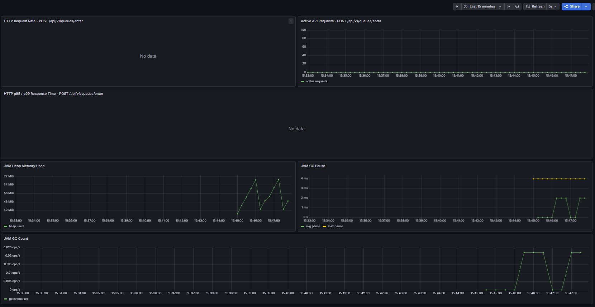 |
| during | 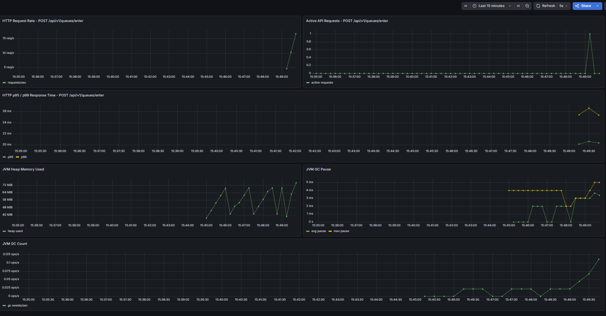 |
| after | 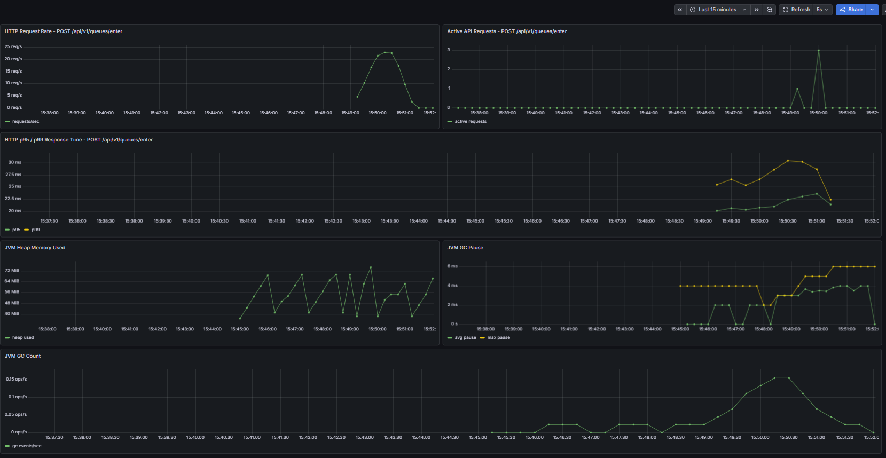 |

### Load

| 구간 | 캡처 |
| --- | --- |
| before | 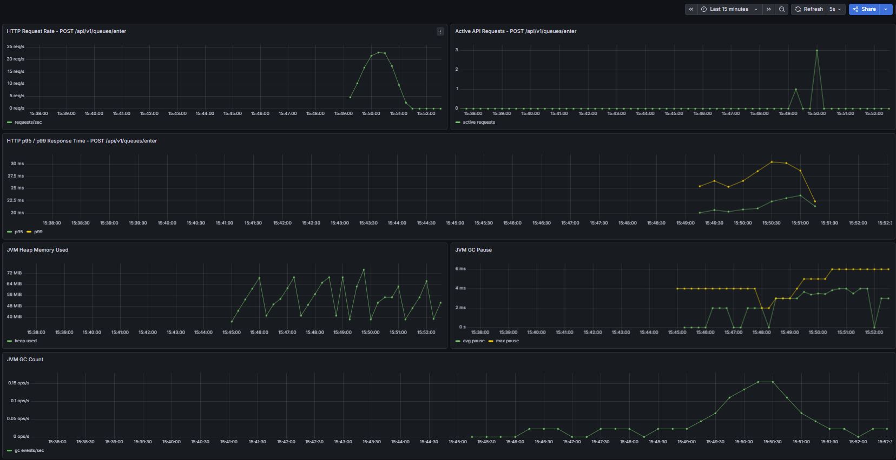 |
| during | 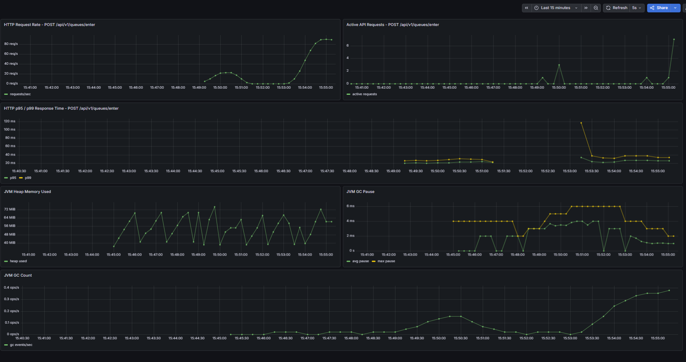 |
| after | 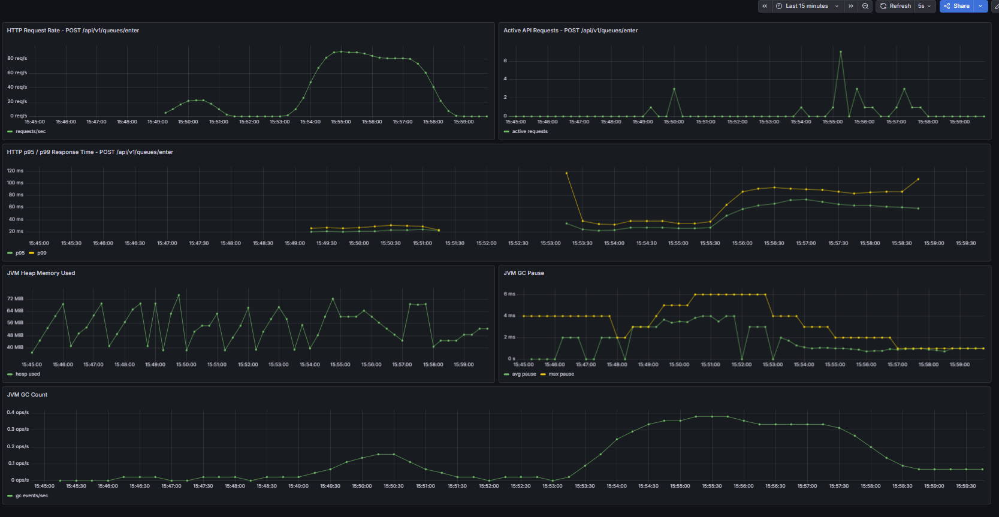 |

### Stress

| 구간 | 캡처 |
| --- | --- |
| before | 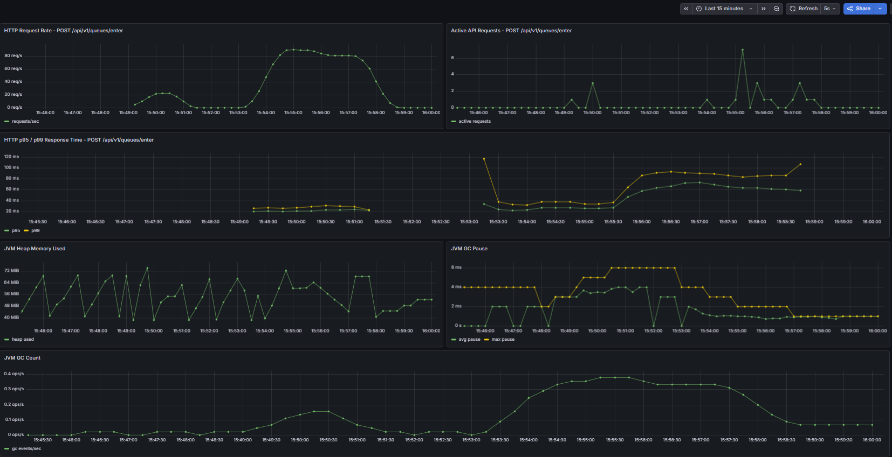 |
| during | 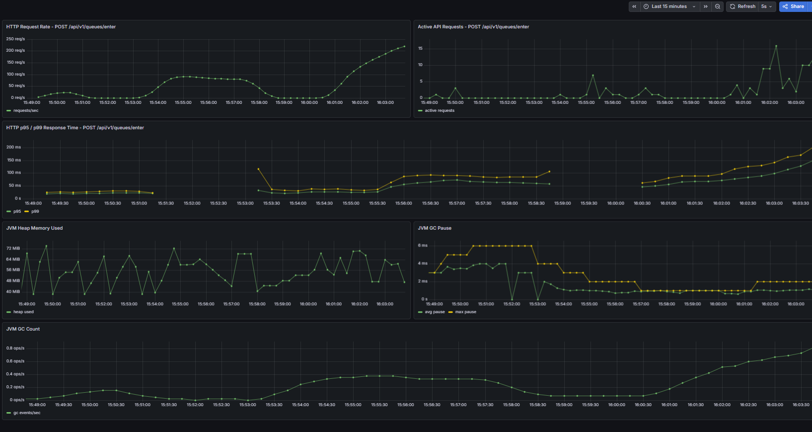 |
| after | 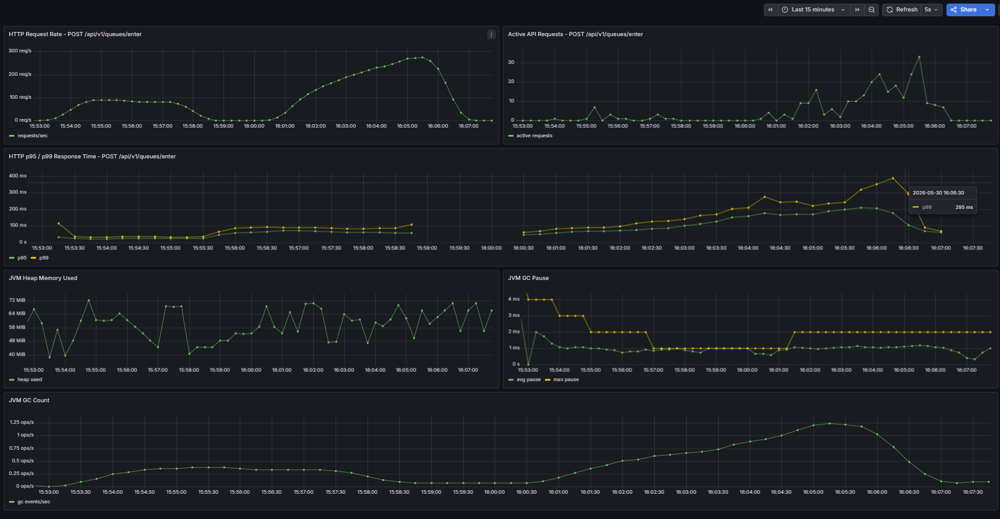 |

### Spike

| 구간 | 캡처 |
| --- | --- |
| before | 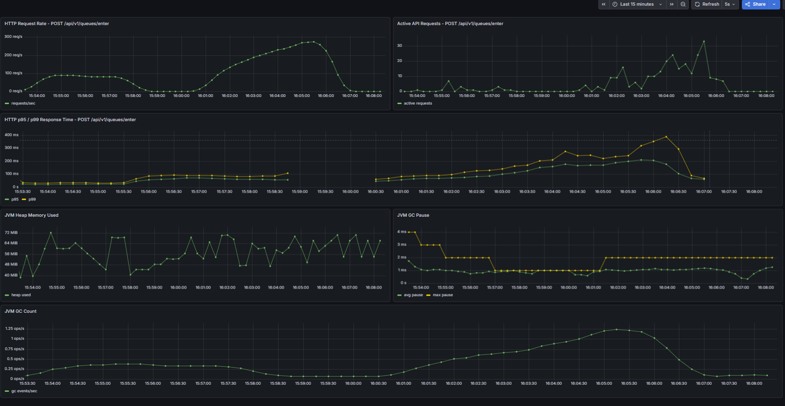 |
| during | 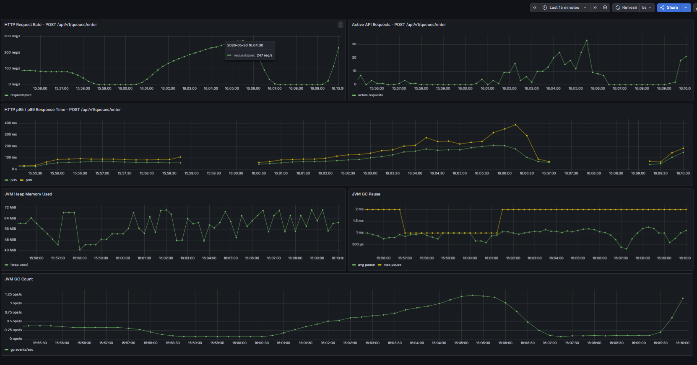 |
| after | 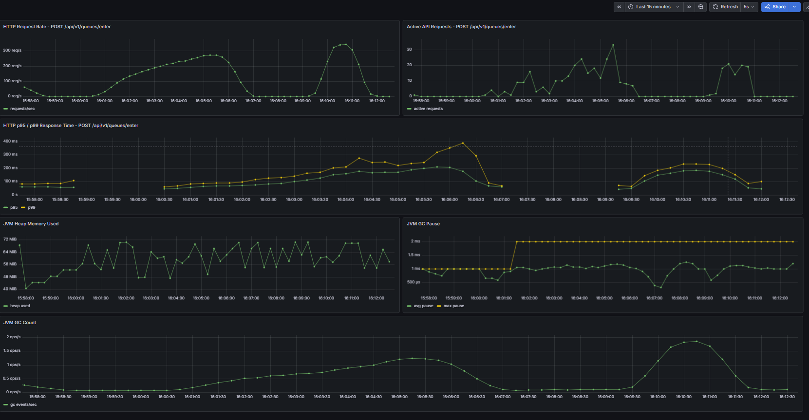 |

## 원본 결과 파일

| 시나리오 | k6 결과 파일 |
| --- | --- |
| smoke | `docs/load-test/smoke-result.txt` |
| load | `docs/load-test/load-result.txt` |
| stress | `docs/load-test/stress-result.txt` |
| spike | `docs/load-test/spike-result.txt` |

## 한계

- 로컬 단일 API 인스턴스에서 수행한 테스트이므로 운영 환경의 다중 인스턴스, 네트워크 지연, 클라우드 리소스 제한을 반영하지 않는다.
- k6도 같은 로컬 머신에서 실행했기 때문에, 부하 생성 클라이언트와 서버가 일부 시스템 리소스를 공유한다.
- 테스트 대상은 대기열 진입 API 중심이며, 상태 조회 API와 장시간 대기 사용자 패턴은 별도로 검증하지 않았다.
- 각 시나리오는 비교적 짧게 수행됐기 때문에 장시간 운용 중 발생할 수 있는 memory leak, connection leak, outbox backlog 누적 여부는 별도 soak 테스트가 필요하다.
- Docker Compose 기반 인프라는 운영 Redis/MySQL/Kafka 구성과 replication, persistence, network topology가 다르다.

## 다음 개선 작업

- `soak` 시나리오를 추가해 30분 이상 지속 부하에서 heap, GC, connection pool, outbox backlog를 확인한다.
- Redis command latency와 HikariCP active/pending connection을 Grafana 대시보드에 추가한다.
- Kafka consumer lag와 outbox pending/dead event 지표를 HTTP/JVM 대시보드와 함께 비교한다.
- 상태 조회 API를 포함한 혼합 시나리오를 작성해 실제 사용자 흐름에 가까운 부하를 검증한다.
- API 인스턴스를 2개 이상으로 늘린 뒤 Redis key 설계와 outbox relay가 수평 확장 환경에서도 안정적인지 확인한다.

## 결론

측정한 네 가지 시나리오 모두 통과 기준을 만족했다.
현재 로컬 테스트 환경 기준으로 `POST /api/v1/queues/enter` 엔드포인트는 일반 부하, 고부하, 순간 급증 부하에서 오류 없이 동작했으며, 응답 시간도 설정한 기준 내에 머물렀다.

이번 테스트는 대기열 진입 API의 기본 처리 안정성과 JVM 관측 지표를 확인하는 1차 검증이다.
운영 수준의 성능 판단을 위해서는 더 긴 지속 부하, 혼합 API 시나리오, 다중 인스턴스 환경, Redis/MySQL/Kafka 병목 지표를 추가로 검증해야 한다.
