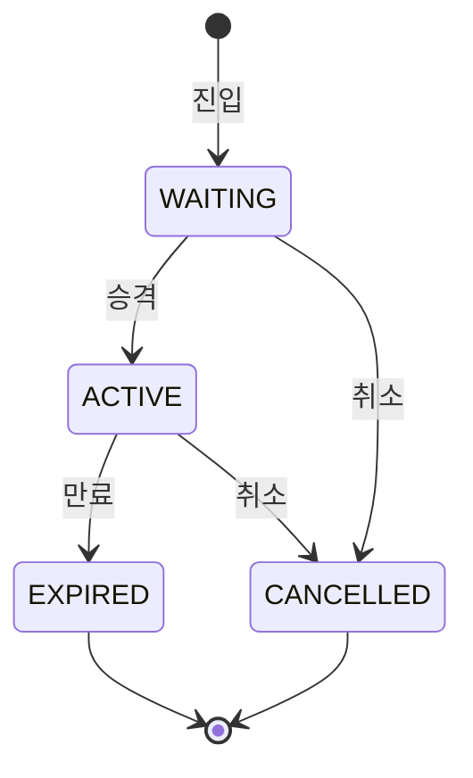

# 대기열 라이프사이클

## 상태

| 상태 | 의미 | 조회 응답 |
| --- | --- | --- |
| `WAITING` | 대기열에 들어왔지만 아직 active 입장 가능 상태가 아님 | `position`, `aheadCount` 제공 |
| `ACTIVE` | downstream 진입이 허용된 상태 | `aheadCount = 0`, `expiresAt` 제공 |
| `EXPIRED` | active TTL이 지나 만료된 상태 | terminal 상태, 위치 정보 없음 |
| `CANCELLED` | 취소된 상태 | terminal 상태, 위치 정보 없음 |

`ADMITTED`는 저장 상태가 아니라 Kafka lifecycle event type이다. 실제 entry 상태는 `ACTIVE`다.

## 상태 전이

## 주요 정책

- 동일 `queueId`, `userId`로 재진입하면 기존 token을 반환한다.
- `WAITING` 순번은 Redis sorted set rank를 1-based로 변환해 반환한다.
- `ACTIVE` 사용자는 `position = null`, `aheadCount = 0`으로 응답한다.
- `EXPIRED`, `CANCELLED`는 terminal 상태이므로 `position`, `aheadCount`를 응답하지 않는다.
- active 만료는 `queue:active-expiry:{queueId}` zset score를 기준으로 batch 처리한다.
